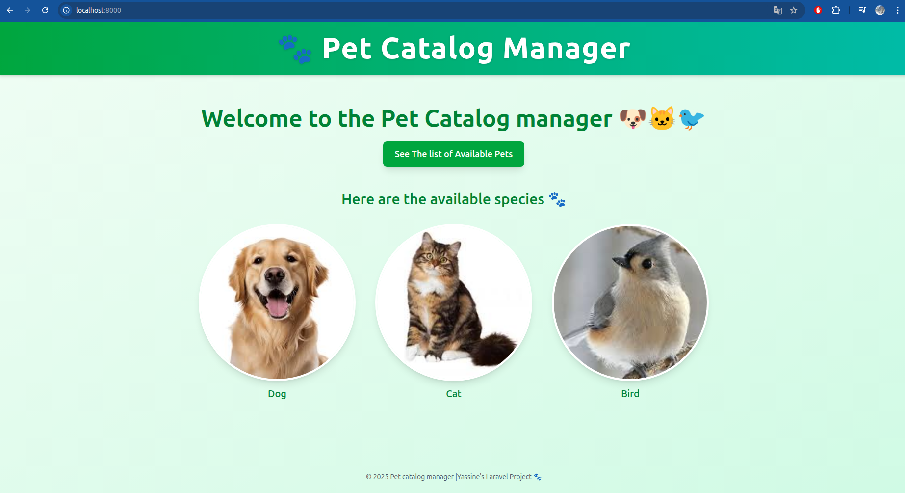
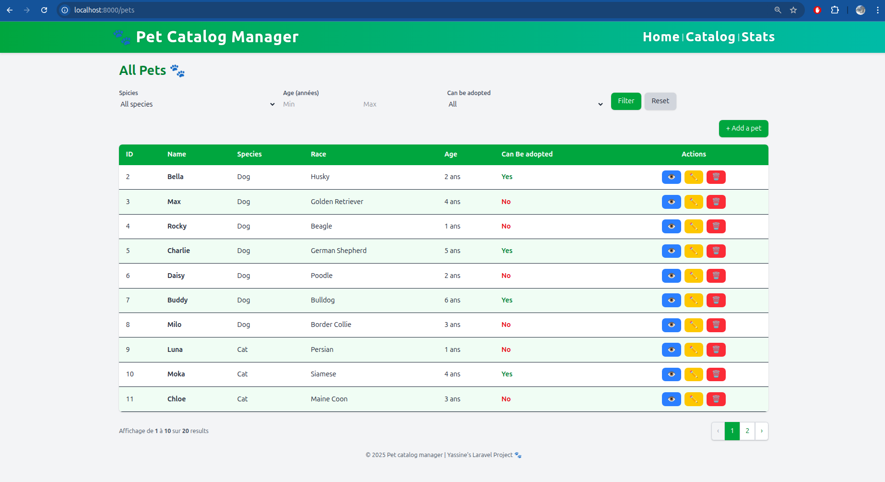
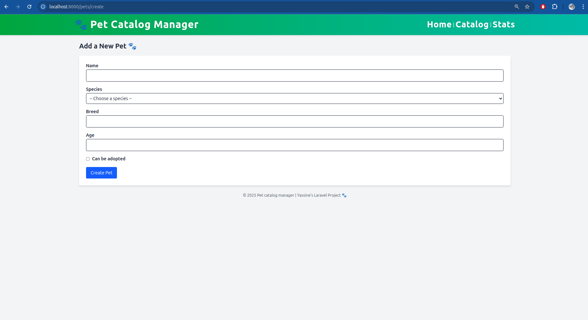
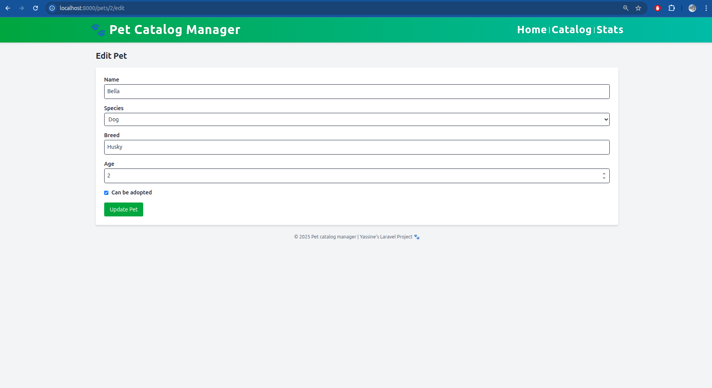
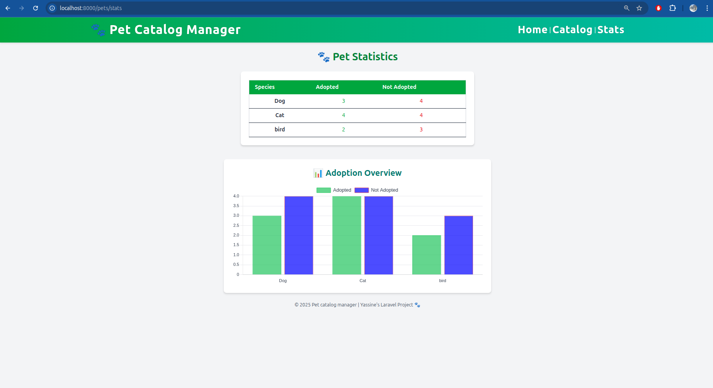
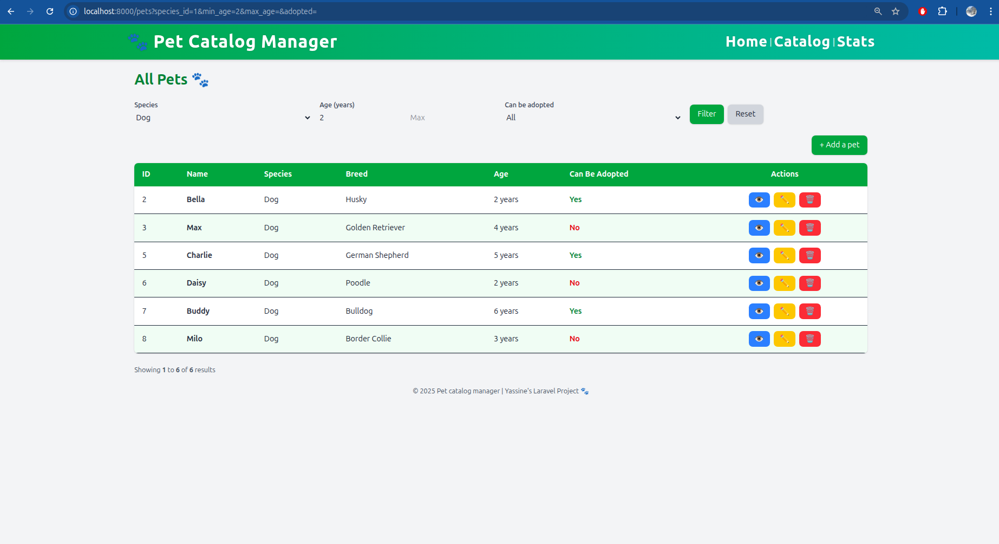

# 🐾 Pet catalog manager – Laravel 12.33

This project is a **Pet Catalogue Management System** built with **Laravel 12.33** , **PHP 8.4**, and **TailwindCSS**.
It allows the user to manage a catalogue of animals through a complete **CRUD system** (Create, Read, Update, Delete).
This project was developed as a **Midterm Project** for the Web Framework course at ITS Surabaya.

## Lecturer : **Sir Agus Budi Raharjo**

## Author : **Gharbi Yassine**

## 🚀 Features (updated)

### Feature overview :

-   🐶 Create, edit, view, and delete pets
-   🐱 Link each pet to a species (Dog, Cat or Bird)
-   🔍 Show page with detailed information for each pet
-   ✅ Server-side form validation
-   📨 Success messages after each CRUD action
-   🎨 Responsive layout styled with TailwindCSS
-   🔎 Search & Filters on the pets listing:
    -   Species
    -   Age (Min and Max numeric inputs on the same line)
    -   Adopted (Yes / No / All)
    -   Pagination preserves filter query parameters
-   🧩 Clean MVC structure using Laravel’s Eloquent ORM
-   💾 Database with 2 related models: `Pet` and `Species`
-   📊 Statistics page displaying adoption data by species
-   📈 Interactive bar chart using Chart.js for visual representation

### 🏠 Home Page

A **welcome page** (welcome.blade.php) serves as the landing page,
redirecting users to the pet catalogue with a simple and responsive layout.


### 📋 Main Catalogue Interface (Index Page)

The main page displays all pets in a paginated table.  
Users can apply filters by species, age, or adoption status.

📸 **Screenshot – Main Index Page**


### 🐶 Create

The user can add a new pet by filling out a form with validation w (species, name, breed, age, and adoption status).
With the **Add pet btn**

📸 **Screenshot – Create Form**



### ✏️ Edit Pet inforamtions

Each pet can be updated easily from the edit page.  
Form validation ensures data consistency.

📸 **Screenshot – Edit Pet Page**



### 📊 Statistics Page

A dedicated Statistics view displays the number of adopted and non-adopted pets for each species.
Can be entered bu the Stats btn on layout :

📸 **Screenshot – Stats view**


**Features:**

-   Clean summary table showing adoption counts per species
-   Bar chart powered by Chart.js for quick data visualization
-   Simple responsive layout using TailwindCSS
-   Linked in the main navigation bar for easy access

## 🧠 Project Overview

### Purpose

The goal of this project is to implement the **Laravel MVC architecture** through a real-world example:  
a small web application to manage animal catalog.

The project demonstrates:

-   Routing
-   Controller logic (PetController@index now supports species, min_age, max_age and adopted filters)
-   Model relationships
-   Form validation
-   Dynamic Blade templates with TailwindCSS
-   Integration of Chart.js for simple data visualization
-   Blade template reusability with layout components

---

## 🧱 Database Schema

### **Table: species**

| Column     | Type      | Description                   |
| ---------- | --------- | ----------------------------- |
| id         | int       | Primary key                   |
| name       | string    | Species name (e.g., Dog, Cat) |
| created_at | timestamp | Creation date                 |
| updated_at | timestamp | Update date                   |

### **Table: pets**

| Column     | Type        | Description                          |
| ---------- | ----------- | ------------------------------------ |
| id         | int         | Primary key                          |
| name       | string      | Pet name                             |
| breed      | string      | Breed name                           |
| age        | integer     | Pet age                              |
| adopted    | boolean     | Adoption status (for data demo only) |
| species_id | foreign key | Links to `species.id`                |
| created_at | timestamp   | Creation date                        |
| updated_at | timestamp   | Update date                          |

# 🌱 Database Seeding (Updated with Bird Species)

The database includes three species:

-   🐶 Dog
-   🐱 Cat
-   🐦 Bird

## 🔎 How to use the filters

1. Open the pets list page (e.g. GET /pets).
2. Use the filter form at the top:
    - Select a species (or leave empty for all).
    - Enter numeric values for "Min" and "Max" age (both on the same line).
    - Choose "Can be Adopted" option : Yes / No / All.
    - Click "Filtrer". Click "Reset" to clear filters.
3. Pagination links keep the current filter query parameters.

📸 **Screenshot – Filter**



---

## 🧩 Reset DB and seed

```bash
php artisan migrate:fresh --seed
```

### 🐶 Add default species data

```bash
php artisan tinker
>>> App\Models\Species::create(['name' => 'Your_species']);
```

---

## ⚙️ Quick installation

1. Clone and install backend deps:

```bash
git clone https://github.com/ENISSAY39/pet_catalog_managment.git
cd pet-adoption
composer install
```

2. Frontend:

```bash
npm install
npm run dev
```

3. Environment:

```bash
cp .env.example .env
php artisan key:generate
```

4. Migrate:

```bash
php artisan migrate
```

5. Run dev server:

```bash
composer run dev
```
